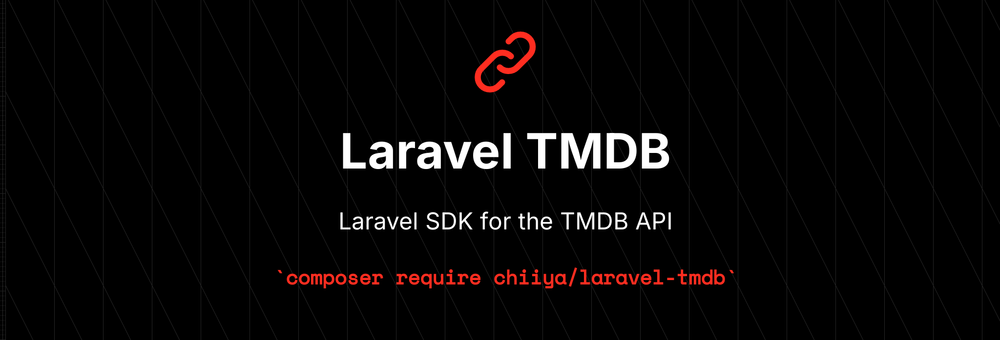

<p align="center">
    <a href="https://packagist.org/packages/chiiya/laravel-tmdb" target="_blank"></a>
    <a href="https://github.com/chiiya/laravel-tmdb/actions?query=workflow%3Alint+branch%3Amaster" target="_blank"></a>
    <a href="[#quality-assurance](https://packagist.org/packages/chiiya/laravel-tmdb)" target="_blank"></a>
</p>

A strongly-typed PHP SDK for the TMDB (The Movie Database) API, providing complete coverage of all
non-user related APIv3 endpoints with full type safety and IDE autocompletion support.

Uses the Laravel HTTP client for making requests, allowing for easy fake responses in tests.

## Index

<pre>
<a href="#installation">> Installation</a>
<a href="#quick-start">> Quickstart</a>
<a href="#changelog">> Changelog</a>
<a href="#contributing">> Contributing</a>
<a href="#license">> License</a>
</pre>

## Installation

Install the package via Composer:

```bash
composer require chiiya/laravel-tmdb
```

Next, configure your TMDB API token in your .env file. This should be your
API Read Access Token (v4 auth):

```bash
TMDB_API_TOKEN="eyJh..."
```

## Quick Start

```php
use Chiiya\Tmdb\Repositories\MovieRepository;
use Chiiya\Tmdb\Query\AppendToResponse;

class TmdbService {
    public function __construct(
        private MovieRepository $movies,
    )
    
    public function handle(): void
    {
        $this->movies->getMovie(550);
        $this->movies->getPopular();
        $movie = $this->movies->getMovie(550, [
            new AppendToResponse([
                AppendToResponse::IMAGES,
                AppendToResponse::WATCH_PROVIDERS,
            ]),
        ]);
        $movie->watch_providers['US']->flatrate[0]->provider_name;
    }
}
```

See [`tmdb-php`](https://github.com/chiiya/tmdb-php) for more examples and documentation.

## Changelog

Please see [CHANGELOG](CHANGELOG.md) for more information on what has changed recently.

## Contributing

Please see [CONTRIBUTING](.github/CONTRIBUTING.md) for details.

## License

The MIT License (MIT). Please see [License File](LICENSE.md) for more information.
